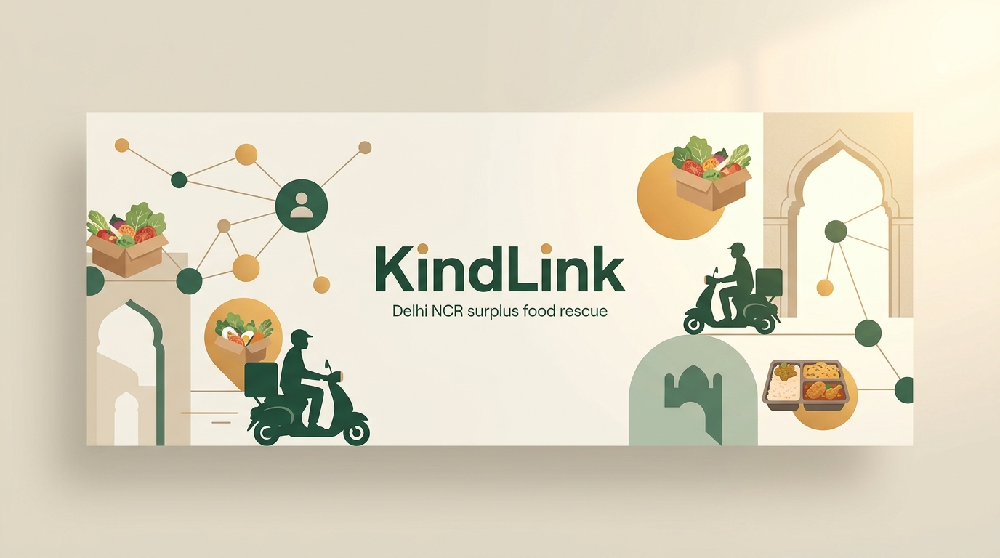

  

<h1 align="center">🌱 KindLink — Connect. Contribute. Create Real Impact.</h1>

  <strong>A Hyper-Local Food Rescue Ecosystem & Verified NGO Redistribution Network for Delhi NCR</strong>

  
  
  
  
  

---

## 📖 Table of Contents

- [The Story Behind KindLink](#the-story-behind-kindlink)
- [The Dual Crisis in Delhi NCR](#the-dual-crisis-in-delhi-ncr)
- [How KindLink Solves the Discoverability Gap](#how-kindlink-solves-the-discoverability-gap)
- [The 3-Step Zero-Waste Pipeline](#the-3-step-zero-waste-pipeline)
- [Core Platform Pillars](#core-platform-pillars)
  - [1. Commercial Food Surplus Dispatch](#1-commercial-food-surplus-dispatch)
  - [2. Shelter & Night School Receiving Feed](#2-shelter--night-school-receiving-feed)
  - [3. The Delhi NGO Verified Directory](#3-the-delhi-ngo-verified-directory)
  - [4. Commercial Food Waste & Section 80G Tax Savings Calculator](#4-commercial-food-waste--section-80g-tax-savings-calculator)
  - [5. Intelligent Spatial Matching Agent](#5-intelligent-spatial-matching-agent)
- [Ground Reality: Authentic Field Impact](#ground-reality-authentic-field-impact)
- [Trust, Safety & Food Hygiene Standards](#trust-safety--food-hygiene-standards)
- [Delhi NCR Active Hubs](#delhi-ncr-active-hubs)
- [Meet Team IMPACTRIX](#meet-team-impactrix)
- [The Vision Ahead](#the-vision-ahead)

---

## 🌟 The Story Behind KindLink

Every single night across Delhi NCR, two starkly contradictory realities unfold within just a few kilometers of each other:

1. **Banquet halls in Aerocity, upscale bakeries in Hauz Khas Village, and fine-dining restaurants in Connaught Place** pack up fresh, hygienic, unconsumed food—trays of rich dal makhani, dozens of artisan sourdough loaves, and wholesome steamed rice—and discard them into municipal dumpsters simply because there is no frictionless, immediate way to transport them before morning.
2. **Outside the gates of AIIMS Hospital, along the railway lines of Paharganj, and across open-air night shelters in Sarai Kale Khan**, thousands of underprivileged families, patient attendants, and vulnerable children sleep with empty stomachs, hoping for a warm meal.

This is not a scarcity problem. **It is an engineering and logistics disconnect.**

**KindLink** was conceptualized and crafted to dismantle this divide. By substituting slow bureaucracy and delayed phone calls with a rapid, geofenced, 1-click rescue protocol, KindLink transforms perishable surplus into nourishing community dinners in minutes.

> *"Food waste is not just an environmental loss—it is a lost opportunity to uphold human dignity. KindLink exists to make kindness instant, reliable, and verifiable."*

---

## ⚖️ The Dual Crisis in Delhi NCR

| The Food Waste Crisis | The Hunger & Shelter Deficit |
|---|---|
| **Landfill Accumulation**: Over **4,500 tonnes** of municipal solid waste enter the Ghazipur and Okhla landfills daily, generating tons of methane greenhouse gas emissions. | **Severe Evening Deficits**: Delhi night shelters and hospital community kitchens face critical dinner shortages nightly, relying heavily on inconsistent ad-hoc donations. |
| **Commercial Hesitancy**: Restaurants and hotels want to donate, but fear food safety liability, lack insulated transit, and find donation paperwork time-consuming. | **Discoverability Barrier**: Compassionate citizens and donors don't know which local shelter is genuine, which has urgent need tonight, or whether goods reach actual people. |
| **Middleman Marketing Fees**: Traditional aggregators swallow significant percentages in overhead, leaving little value for grassroots workers. | **Zero Middlemen**: Grassroots organizations need direct peer-to-peer relationships with neighborhood kitchens, bakeries, and wholesale markets. |

---

## ⚡ How KindLink Solves the Discoverability Gap

KindLink bridges this gap through four core technological breakthroughs:

- **Hyper-Local Radius Clustering**: Hot meals spoil quickly. KindLink matches donors strictly with shelters within a **3 to 7-kilometer delivery radius**, ensuring thermal integrity and delivery times under 30 minutes.
- **Vetted 20 Delhi Non-Profit Directory**: Every listed shelter and NGO is cataloged with government registration credentials (Darpan / 12A / 80G numbers), verified ground photos, and direct WhatsApp links for immediate peer-to-peer verification.
- **Automated CSR & Section 80G Tax Certificates**: Upon verified delivery confirmation, commercial donors immediately receive an official digital tax exemption receipt detailing meals rescued and monetary relief value.
- **Strict Temperature Holding Classification**: Donors specify food temperature tier (**Hot Steam Pan > 65°C**, **Chilled < 4°C**, or **Shelf-Stable Bakery**), guaranteeing strict adherence to FSSAI safe food redistribution guidelines.

---

## 🔄 The 3-Step Zero-Waste Pipeline

| Stage | Action by Stakeholder | Technology Enabler | Typical Turnaround |
|---|---|---|---|
| **Step 1: Rapid Post** | Chef / Restaurant Manager logs surplus with photo, temperature tier, & portion count. | 1-Click Kitchen Presets & Dynamic Expiry Countdown | **< 30 Seconds** |
| **Step 2: Geofenced Claim** | Local verified Delhi shelter locks the drop based on proximity & dinner need. | Hyper-Local Radius Clustering (3–7 km) | **< 2 Minutes** |
| **Step 3: Thermal Rescue** | Dedicated volunteer courier transports hot/chilled food; digital 80G receipt issued. | Real-Time Courier Telemetry & Automated CSR Logging | **< 30 Minutes** |

### 1. Commercial Donor Posts in 30 Seconds
Chefs, bakery managers, or caterers snap a photo, pick their approximate portion count, select food category and storage temperature, and specify a strict pickup window. The drop is broadcast immediately to nearby verified shelters.

### 2. 1-Click Geofenced Shelter Claim
Nearby verified community kitchens receive a priority notification. A single tap locks the drop for that organization, removing it from the public queue and preventing duplicate pickups.

### 3. Thermal Transit & Automated 80G Receipt
A volunteer or partner courier dispatches with thermal insulated gear. Upon handover confirmation, the platform automatically issues a Section 80G tax receipt and logs an FSSAI-compliant digital temperature audit trail.

---

## 🏛️ Core Platform Pillars

### 1. Commercial Food Surplus Dispatch
- **1-Click Kitchen Presets**: Pre-configured profiles for quick posting during busy closing hours:
  - *Connaught Place Buffet Overrun* (Hot Curries & Steamed Rice)
  - *Hauz Khas Artisan Bakery* (Fresh Loaves & Pastries)
  - *Aerocity Hospitality Catering* (Packed Thali Lunches)
  - *Saket Organic Grocery* (Farm Fresh Crates)
- **Live Real-Time Card Preview**: Donors observe an identical live mirror of how recipients view their food drop, complete with countdown urgency badges and dietary tags.

### 2. Shelter & Night School Receiving Feed
- **4-Stage Status Lifecycle Management**:
  - `🟢 AVAILABLE` → Fresh food drop ready for immediate claim.
  - `🟡 CLAIMED` → Locked by a verified shelter; courier assigned.
  - `🛵 IN TRANSIT` → Live animated courier telemetry tracking electric scooter transit.
  - `✅ DELIVERED` → Delivered, logged, and tax certificate issued.
- **Emergency Requirement Broadcaster**: Night shelters can broadcast immediate deficits (e.g., *"60 hot dinners needed outside AIIMS Gate 2 in under 2 hours"*) directly to local commercial donors.

### 3. The Delhi NGO Verified Directory
- **20 Grassroots Delhi Organizations**: Comprehensive database of verified shelters, child welfare projects, environmental foundations, and hunger relief kitchens across NCR.
- **Direct Contact Architecture**: Direct WhatsApp coordinator buttons (`💬 WhatsApp Coordinator`) and direct phone dials to completely eliminate marketing middlemen.
- **Live Progress Bars**: Real-time progress trackers reflecting urgent deficit fulfillment percentages for daily grocery and meal requirements.

### 4. Commercial Food Waste & Section 80G Tax Savings Calculator
- An interactive economic model helping Delhi restaurants and hotels calculate the financial and environmental value of their surplus:
  - **Portion Slider**: Compute projected monthly impact across 10 to 300+ daily portions.
  - **Annual Tax Deduction**: Instant calculation of Section 80G tax write-offs for corporate CSR compliance.
  - **GHG Emissions Averted**: Quantifies kilograms of methane and carbon dioxide prevented from entering Delhi landfills.
  - **Centers Supported**: Calculates exact number of community kitchens sustained by the donor's recurring portions.

### 5. Intelligent Spatial Matching Agent
- Live neural compatibility simulation calculating optimal zero-waste routing matches based on:
  - Geographic distance and transit corridors
  - Perishability urgency and holding temperatures
  - Shelter dietary preferences and meal capacity

---

## 📸 Ground Reality: Authentic Field Impact

KindLink features authentic, verified field photography from active non-profit drives across Delhi NCR:

1. **Bibharte NGO (Regd. No: 1190/2018)** — Educational stationery kits and wholesome meal distribution to underprivileged students in West Delhi.
2. **Hamari Pahchan NGO (Drishti Project)** — Open-air night literacy and dinner drives under urban streetlights for underprivileged youth.
3. **Vrikshit Foundation (Urban Sanitation Drive)** — Massive municipal clean-up and organic waste segregation mobilization across the Delhi Ridge.
4. **Vrikshit Foundation ("Clean India, Healthy India")** — Environmental restoration drives restoring natural biodiversity along river catchment areas.
5. **Salaam Baalak Trust (Shelter Learning Center)** — Wholesome nutrition and safe shelter education programs for runaway and street-connected youth near Delhi railway terminals.

---

## 🛡️ Trust, Safety & Food Hygiene Standards

- **FSSAI Compliance**: All food rescue logs record strict dispatch timestamps, preparation times, and temperature holding brackets.
- **Thermal Transit**: Couriers utilize insulated thermal bags to keep hot food above 65°C and chilled produce under 4°C during Delhi transits.
- **Verified 80G Tax Receipts**: Authentic, non-profit tax exemption certificates issued upon OTP delivery verification.
- **Zero Commission**: 100% of pledged food and volunteer resources pass directly to community plates.

---

## 📍 Delhi NCR Active Hubs

KindLink's routing grid covers all major Delhi culinary and shelter corridors:

- **Connaught Place (CP)**: Commercial restaurant overrun & inner-circle night distribution.
- **AIIMS & Safdarjung Ward**: Outstation patient families and hospital night kitchen relief.
- **Hauz Khas Village**: Artisan bakeries and organic cafe surplus redistribution.
- **Paharganj Railway Corridor**: Emergency food routing for railway night shelters and youth refuges.
- **Saket & Malviya Nagar**: Retail supermarket crates and South Delhi community kitchens.
- **Okhla Industrial Sector**: Large-scale corporate cafeteria luncheon transfers.
- **Rohini & Pitampura**: North-West Delhi residential community welfare drives.

---

## 👥 Meet Team IMPACTRIX

KindLink was engineered and designed by **Team IMPACTRIX** for Delhi NCR social innovation:

| Member | Focus Area | Core Contribution |
|---|---|---|
| **Tanmay** | **Project Lead & Systems Architecture** | End-to-end platform vision, full stack data engineering, and operational pipeline design. |
| **Vivek** | **Core Backend & Data Engineering** | Real-time state orchestration, NGO data schema, and FSSAI audit logging. |
| **Mahi** | **UI/UX & Visual Design** | Warm linen aesthetic, design system, interactive micro-interactions, and accessible typography. |
| **Ritika** | **Operations & NGO Verification** | Delhi NGO field research, partner verification protocols, and ground reality narrative curation. |
| **Satyam** | **Systems Architecture & Performance** | Animation physics engine, 3D tilt mechanics, and lightweight rendering optimization. |
| **Vishesh** | **Full Stack Development** | Interactive calculator logic, courier telemetry flow, and responsive layout engineering. |
| **Pujitha** | **Product Strategy & User Research** | User empathy mapping, shelter recipient interviews, and CSR compliance requirements. |

---

## 🔮 The Vision Ahead

1. **Autonomous WhatsApp Bot Dispatch**: Allowing Delhi restaurant chefs to send a 10-second voice note or photo over WhatsApp to automatically create and publish a geofenced food drop.
2. **IoT Cold-Chain Telemetry**: Smart temperature probes inside courier thermal bags streaming live telemetry to guarantee zero temperature breach.
3. **Delhi Wholesale Mandi Surplus Linkage**: Integrating wholesale vegetable and fruit surpluses from Azadpur Mandi directly with centralized soup kitchens across the capital.

---

  <strong>KindLink Ecosystem</strong> • Designed and Engineered by <strong>Team IMPACTRIX</strong> 
  <em>Powering zero-hunger, compassionate community action across Delhi NCR.</em>

